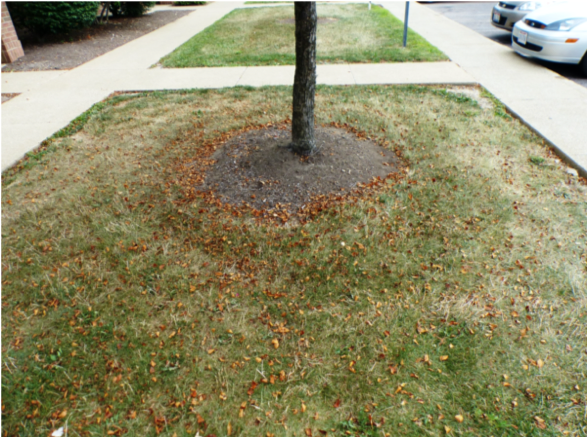

# Image Tagging for Cortexia

Here we have some information for our taggers.

## Table of Contents

- Intro
- How to tag
  - categories
  - examples
  - Useful tips
- Using the Cortexia tagging tool

## Intro

## How to tag

For each identified object we need the bounding box and the class. See next section for the classification.

- boxes can overlap. As long as an object can be identified it should be tagged.
- objects can be cut off or partially hidden. E.g. hidden by image boundary, other objects, or poor lighting. As long as the visible part of the object allows to identify its classification, it should be tagged.
- The same applies to blurry parts of the image, or parts with poor lighting. 
- what is the minimum size of an object in pixel? - no fixed boundary, but many objects are small. We probably need a size of 5x5 pixel to identify the classification
- special cases: leaves are only litter on fixed ground. on green areas they are not considered as litter: 
  - to be tagged: 
  - not to be tagged: 

### categories

Please see the list of categories [here](./categories.md)

### examples

## output format

We will need the output as JSON file if possible (unless you are using our tagging toold which will take care of this automatically). Our sample JSON format is [here](./cortexia-sample.json).

## Using the Cortexia tagging tool

Please see the tool-specific information [here](tagging-tool.md)
