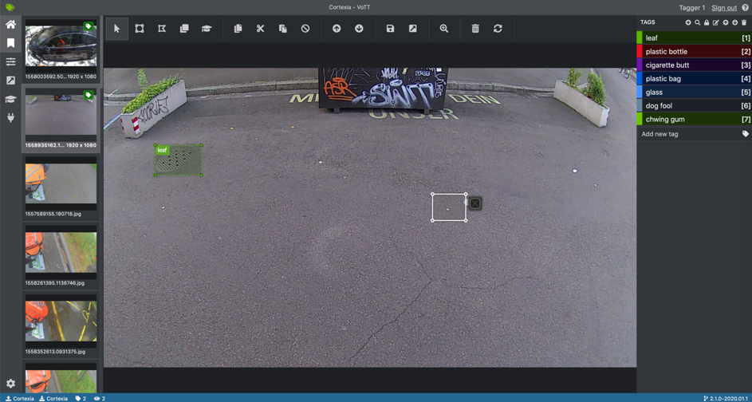
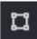
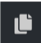
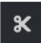
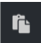
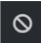
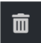
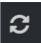
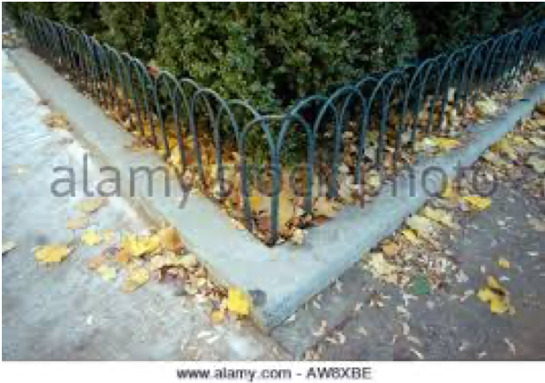

# Cortexia tagging tool

This page describes the use of the Cortexia tagging tool. The general information about tagging are [here](./index.md)

## Table of Contents

- Using the Cortexia tagging tool
  - Registration
  - Your Work Queue
  - Tagging an image
  - Saving your work
- References

## Using the Cortexia tagging tool

Cortexia has a tagging application set up where you can find 
the work queue of images to tag, and save your data right away. 

No hassle, you just need a browser and internet.

## Registration

Cortexia will provide you with the credentials to get into the tagging application: 

- login (your email)
- password

To log in visit https://vott.cortexia.io/ and enter your email and password. Then wait till the images appears. It could take some time depending on your connection for the first time.

## Your Work Queue

In the application you will first find a list of images. 
Please pick one and try to identify waste (or litter) on the images. 

Typical cases would be 

- cigarettes 
- glass bottles 
- plastic bottles
- newspapers
- broken glass
- dog fouling
- leaves

The complete list of litter categories is available in the application or [here](categories.md)

## Interface

The main interface looks like the image below. You'll find:

- on the top the tools bar
- on the left you have menus (no need to modify something there, the project is already set up) and the preview of the images with their stats (explanation below).
- on the right you find the different tags (litter categories).
- In the center you have the image to tag.

## Toolbar

 To create regions around litters (after creating the region choose a tag from the right by clicking on it or by using the shortcut from 0 to 9).

 To select regions and move and resize them (also possible with the upper tool).

 To copy the region also possible with the normal keyboard short cut.

To cut the region also possible with the normal keyboard short cut.

 To past the region also possible with the normal keyboard short cut.

 To remove all regions (confirmation is required).

 To have information about how to zoom available here are the links:

- Mac OS: https://www.youtube.com/watch?v=bz2JrEwvFWs&feature=youtu.be
- Windows: https://www.youtube.com/watch?v=xNhF1NJ78NE&feature=youtu.be
- Ubuntu: https://www.youtube.com/watch?v=pFwblGYjzSs&feature=youtu.be

 To delete an image

 To load new images. Should be used when you tagged all images. Your current tagged image is sent to the server and saved.

 To navigate through the images. You can also use the keyboard arrows or click on the preview of the desired image.

## Tagging an image

Once connected and the images loaded use the regions creation tool and draw for each identified object a bounding box and the class. To add the class refer to the above regions creation tool.

- boxes can overlap. As long as an object can be identified it should be tagged.
- objects can be cut off or partially hidden. E.g. hidden by image boundary, other objects, or poor lighting. As long as the visible part of the object allows to identify its classification, it should be tagged.
- The same applies to blurry parts of the image, or parts with poor lighting. 
- what is the minimum size of an object in pixel? - no fixed boundary, but many objects are small. We probably need a size of 5x5 pixel to identify the classification
- special cases: leaves are only litter on fixed ground. on green areas they are not considered as litter: 
  - to be tagged: 
  - not to be tagged: 

## Saving your work

When you move from one image to the next, the work is saved automatically, but you can still go back to that image to make more changes. 

However, once you close your session or click on "renew images" (see above), all saved images are removed from your work queue and you cannot make any more changes in another session.

## References

Our tagging platform is based on [VoTT](https://github.com/microsoft/VoTT), please refer to their documentation if you need more details.

