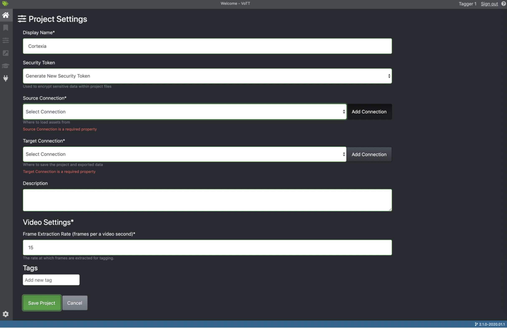
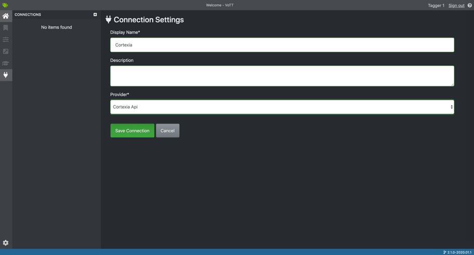
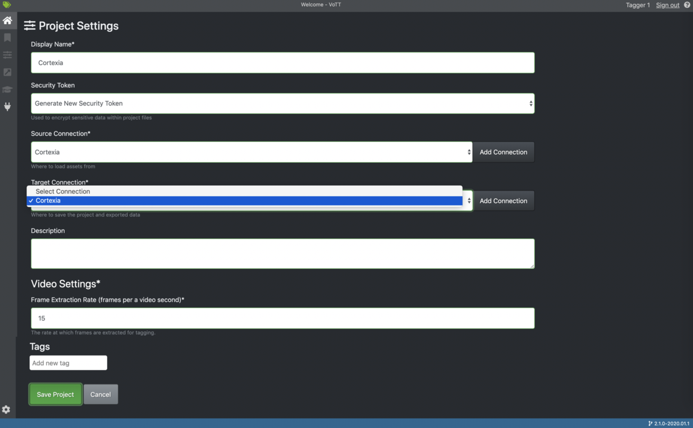

# User creation

Visite https://backend.cortexia.io/ and login whit your admin account. You will arrive on the admin home page. From there click on “create user” in the left menu and fill the required fields.

# User project configuration

After being logged in with the before created user account click on new project. You should arrive on the project configuration page that should look like the below image.
 

 
Before filling the fields create a new connection by clicking on “add connection” and select the Cortexia provider like the below image.

 
After adding the connection, you can fill the field like in the below image and click on “save project”.

